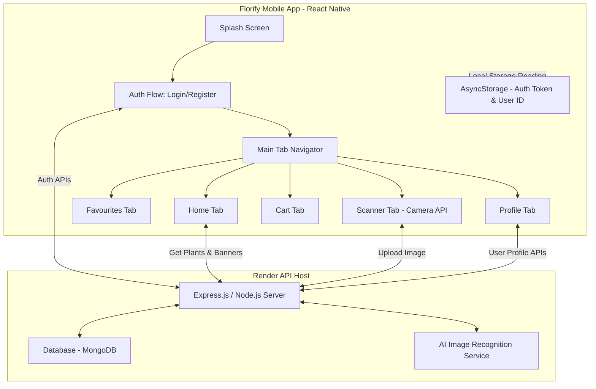
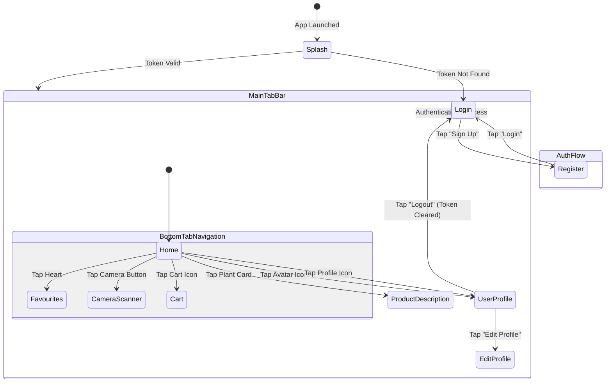

# Florify - Mobile Application Architecture & Documentation

Welcome to the official developer documentation for **Florify** (formerly PlantApp/Flaura). This document outlines the application's architecture, folder structure, screen navigation flow, database schema, API interactions, and a complete build guide.

---

## 1. Application Overview

**Florify** is a modern React Native mobile application designed for plant lovers. It offers:
1. **Plant E-Commerce Shop:** Browse, filter, search, and purchase various indoor/outdoor plants and accessories.
2. **Plant Scanner (AI Care Assistant):** Scan plant leaves using the device's camera to identify plants and retrieve scientific facts and care instructions.
3. **Plant Care Guides:** Detailed maintenance instructions (water, light, soil, temperature) for every plant.

---

## 2. Technical Stack

* **Frontend Framework:** React Native (v0.79.1) with TypeScript and JavaScript (ES6+).
* **Navigation:** React Navigation (Stack and Bottom Tabs).
* **State Management & Local Storage:** React Native AsyncStorage (for Auth Tokens, User IDs, and local caching).
* **Network Client:** Axios (for REST API communication).
* **Styling System:** React Native StyleSheet (Vanilla CSS-in-JS layout with Flexbox).
* **Backend API Host:** Hosted on Render (`https://flaura-app-1.onrender.com/`).

---

## 3. High-Level System Architecture



---

## 4. Directory Structure

Below is the directory mapping for the mobile codebase:

```bash
PlantApp/
├── .bundle/                    # Ruby bundler configuration (iOS)
├── __tests__/                  # Unit and integration tests (Jest)
├── android/                    # Android Native project files (Gradle/Java/Kotlin)
├── ios/                        # iOS Native project files (CocoaPods/Swift)
├── assets/                     # App icons, banner graphics, and local images
├── components/                 # Reusable UI components
│   ├── CustomTabBar.jsx        # Floating/custom bottom navigation bar
│   ├── InputField.jsx          # Styled custom text fields for forms
│   └── ProductCard.jsx         # Card component displaying plant previews
├── navigator/                  # React Navigation stack handlers
│   ├── AppNavigator.jsx        # Root router (Splash -> Auth -> Main)
│   └── MainTabNavigator.jsx    # Handles Bottom Tab pages
├── screens/                    # Core screens/views of the app
│   ├── SplashScreen.jsx        # Checks auth state, displays Florify logo
│   ├── LoginScreen.jsx         # User login form with animations
│   ├── RegisterScreen.jsx      # Signup form
│   ├── HomeScreen.jsx          # Home feed with search, banners, & category filters
│   ├── ProductDescription.jsx  # Detailed plant profile & care guide
│   ├── CartScreen.jsx          # Checkout basket
│   ├── FavouriteScreen.jsx     # Liked plants container
│   ├── PlantScannerScreen.jsx  # Captures leaf images for identification
│   ├── UserProfile.jsx         # Displays account information and logout
│   └── EditProfileScreen.jsx   # Updates user details
├── utils/
│   └── colors.js               # Global UI theme colors (Primary Green, background)
├── apiConfig.js                # Base API host configuration
├── App.tsx                     # Entrypoint wrapper (Toast, Navigation Containers)
├── package.json                # Project dependencies and startup npm scripts
└── tsconfig.json               # TypeScript compiler options
```

---

## 5. Screen Navigation & Flow

The application navigates through three core phases:



### Detailed Flow Steps:
1. **Startup Check:** [SplashScreen.jsx](file:///d:/Plant_App/PlantApp/screens/SplashScreen.jsx) reads the `token` from `AsyncStorage`. If null, redirects to `Login`; otherwise, immediately logs the user into the `Main` application stack.
2. **Interactive Branding:** On the [HomeScreen](file:///d:/Plant_App/PlantApp/screens/HomeScreen.jsx), tapping the small **Florify Logo** at the top triggers a pleasant, animated mint-green bubble saying: *"Hi, I'm Florify! 🌱"*.
3. **Cart Management:** From `ProductDescription`, items are pushed into the database cart. The [CartScreen](file:///d:/Plant_App/PlantApp/screens/CartScreen.jsx) pulls items dynamically, handles quantity modification, and places the final checkout order.

---

## 6. API Endpoint Inventory

All API requests rely on the base host configuration in [apiConfig.js](file:///d:/Plant_App/PlantApp/apiConfig.js).

| HTTP Method | Endpoint | Description | Payload Structure (JSON) |
| :--- | :--- | :--- | :--- |
| **POST** | `/api/login` | Authenticates user credentials | `{ "email": "user@example.com", "password": "securepassword" }` |
| **POST** | `/api/register` | Creates a new user profile | `{ "email": "user@example.com", "password": "securepassword" }` |
| **GET** | `/api/banner_images` | Retrieves horizontal banner slider images | *None* |
| **GET** | `/api/plants_info` | Retrieves catalog of all available plants | *None* |
| **POST** | `/api/plants_info/search` | Filters plants matching a search query | `{ "searchInput": "Fern" }` |
| **GET** | `/api/user/:userId` | Retrieves profile info for a specific user | *None (Requires Auth Token in headers)* |
| **PUT/POST**| `/api/user/:userId` | Updates profile name, phone, or address | `{ "name": "Ritik Patil", "phone": "9999999999", "address": "Indore, India" }` |

---

## 7. Data Models

### Plant Model Schema
```json
{
  "_id": "680b9c8985dd21113a0df281",
  "id": 1,
  "commonName": "Snake Plant",
  "scientificName": "Sansevieria trifasciata",
  "category": "Indoor",
  "description": "An upright, variegated green foliage plant known for air-purifying qualities.",
  "careTips": {
    "light": "Low to bright indirect light.",
    "water": "Water every 2-4 weeks; allow soil to dry completely.",
    "soil": "Well-draining potting mix.",
    "temperature": "60-85°F (15-29°C)."
  },
  "price": 300,
  "image_url": "https://example.com/images/snake_plant.jpg",
  "toxicity": "Toxic to pets if ingested.",
  "maintenance": "Low",
  "airPurifying": true
}
```

---

## 8. Build & Run Guide

To run the application locally on a physical device or simulator:

### Prerequisites
* **Node.js** (Version >= 18 recommended)
* **Java Development Kit (JDK 17)** (for Android compiles)
* **Android Studio** (for Android SDKs and Emulators)
* **Xcode** (macOS only, for iOS simulator and builds)
* **CocoaPods** (for iOS native pods installation)

### Step 1: Clone and Install Dependencies
Navigate to the root directory of the application:
```bash
cd d:/Plant_App/PlantApp
npm install
```

### Step 2: Install iOS Pods (macOS Only)
If building for iOS:
```bash
cd ios
pod install
cd ..
```

### Step 3: Run the Development Server (Metro Bundler)
Start the Metro server:
```bash
npm start
```
*Key controls in the Metro terminal:*
* Press `r` to reload the bundle.
* Press `d` to open the Developer debug menu on the device.

### Step 4: Run the App on a Connected Device

#### For Android (Physical Phone via USB / Emulator):
Ensure your phone has **USB Debugging** enabled and is visible under `adb devices`. Then, run:
```bash
npm run android
```

#### For iOS (macOS / Simulator):
```bash
npm run ios
```

---

## 9. Code Standards & Architecture Guidelines

* **Component Decomposition:** Always divide major widgets into reusable files inside `/components` (e.g. keeping custom buttons, loading spinners, and cards modular).
* **Theme Constancy:** Never write raw color hex codes in styles. Utilize the global colors defined in `utils/colors.js` to ensure the primary branding green (`#4CAF50`) is uniform across screens.
* **Storage and Session Hygiene:** AsyncStorage should only be accessed asynchronously inside React lifecycle hooks or API request wrappers. Ensure clean-up of timers and subscriptions on screen unmounting to avoid memory leaks.

---

## 10. Future Scope & Roadmap

The following features and integrations are planned for future releases of Florify to make it market-ready:

* **Payment Gateway Integration:** Incorporate payment processing platforms like **Razorpay / Stripe** to enable real-money transactions and checkout workflows.
* **Push Notifications:** Set up **Firebase Cloud Messaging (FCM)** or **OneSignal** for user notifications, order tracking alerts, and automated watering/care reminders.
* **Production Store Publishing:** Establish app signing keys (`.keystore`), set up Proguard rules to protect the code, optimize assets, and bundle builds (`.aab` / `.ipa`) for release on the Google Play Store and Apple App Store.
* **Analytics & Crash Monitoring:** Integrate **Sentry** or **Firebase Crashlytics** for real-time monitoring of application performance and live crashes in production.
* **Localization (Multi-Language support):** Introduce internationalization frameworks (such as `react-native-localize` or `i18next`) to support multiple languages (e.g., Hindi, English, etc.) based on user preferences.

